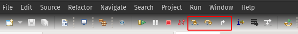

Eclipse
=======

This document describes the use of Eclipse.

import project
--------------

- First of all, start ``eclipse``, open ``File > import`` on the toolbar and select the ``Existing Projects into Workspace`` option under the ``General`` menu to import the projects.

.. figure:: imgs/image01.png
   :alt:

.. figure:: imgs/image02.png
   :alt:

Debug
-----

- First of all, let the board run, make sure the toolbar at the top left of the eclipse is configured as shown in Figure 1 below, then click the icon ``debug`` button in the first red box, the eclipse will compile the project first, after that, you can see the log in the ``Console`` window below the eclipse as shown in Figure 2 below.

.. figure:: imgs/image03.png
   :alt:

.. figure:: imgs/image04.png
   :alt:

- Use the shortcut key ``F8`` to resume, you can see the program stops at the ``void bfl_main()`` main function, you can click the three buttons in the figure below. Their meanings are

   - First Step Into (F5) Single-step execution, entering and continuing single-step execution when sub-functions are encountered.

   - The second Step Over (F6) does not go into subfunctions when encountered within a function during single-step execution, but instead stops the entire execution of the subfunctions as a single step.

   - The third Step Return (F7) is used to finish the remainder of the sub-function and return the previous level function when a single step is executed into the sub-function.

.. figure:: imgs/image05.png
   :alt:

- You can add and remove breakpoints by double-clicking on the leftmost orange bar of the ``code`` window.

.. figure:: imgs/image08.png
   :alt:

- You can also view the corresponding assembly by looking at the ``Disassembly`` window on the right (if that window isn't available, you can add it by going to ``Window > show view > Disassembly`` in the top toolbar).

.. figure:: imgs/image07.png
   :alt:
