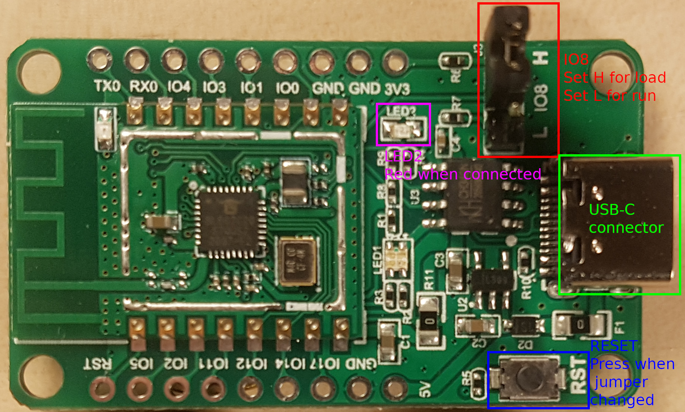

Linux Starter Guide
===================

..
    TODO:
    * Change to impersonal language?
    * Read through.

This document explains how to set up a Linux environment, build the ``sdk_app_helloworld`` application, flash it to the BL602 and verify the output through a serial port reader.

Installing prerequisites and cloning repository
-----------------------------------------------

The project requires a C/C++ compiler, ``make``, ``git`` and a serial port reader (``gtkterm`` is used).

One liner for Debian:

.. code-block:: bash

    sudo apt install build-essential git gtkterm

One liner for Arch:

.. code-block:: bash

    sudo pacman -S base-devel git gtkterm

Next, clone the SDK repository:

.. code-block:: bash

    git clone --recursive https://github.com/pine64/bl_iot_sdk

Compiling
----------------------

First, set ``BL60X_SDK_PATH`` to the location of the ``pine64/bl_iot_sdk`` repository.
Next, set ``CONFIG_CHIP_NAME`` to the make of the chip in this case ``BL602``.
If the repository is already cloned, ``pwd`` can be used to correctly set the environment variable:

.. code-block:: bash

    cd bl_iot_sdk
    export BL60X_SDK_PATH=$(pwd)
    export CONFIG_CHIP_NAME=BL602

In order to build all example projects write ``make`` in the project directory.
In order to build only a single example go to the directory of the example and write ``make``.
In order to build ``sdk_app_helloworld``:

.. code-block:: bash

    cd customer_app/sdk_app_helloworld
    make

Build artifacts will be located in the ``build_out`` folder in each example.
Change into the output of the example you want to flash and ensure that the ``.bin`` file exists:

.. code-block:: bash

    cd build_out
    ls -la *.bin

.. _connecting-hardware:

Connecting the Hardware
-----------------------

Set the jumper on ``IO8`` to cover ``IO8`` and ``H`` (the jumper should be closest to the edge of the board).

   Pine64 BL602 EVB ver 1.1 board. ``IO8`` jumper, ``LED2``, the ``RESET`` button and the USB-C connection have been highlighted.

Connect the board to the computer.
After connecting the board to the computer the ``RESET`` button can be used after changing the jumper setting to without repowering the device.

.. _flashing:

Flashing
--------

Download the latest `blflash <https://github.com/spacemeowx2/blflash/releases>`_ version and ``chmod`` it to be executable:

.. code-block:: bash

    chmod +x blflash*

Invoke the ``blflash`` binary with the ``flash <project_name>.bin --port <port>`` arguments.
If the board is connected via USB and no other devices are connected the port is likely going to be ``/dev/ttyUSB0``.
If in doubt, get a list of USB ports with ``ls -la /dev/ | grep USB``.

If you do not have any such device, ensure your kernel has the `ch341` driver enabled.

.. code-block:: bash

    ./blflash-linux-amd64 flash sdk_app_helloworld.bin --port /dev/ttyUSB0

If flashing is not successful ensure that:

1. The device is connected to the computer correctly (red LED (``LED2``) should be lit).

2. The ``IO8`` jumper is correctly set to cover the ``H`` position. Press ``RESET`` to make sure the jumper change is in effect.

3. The ``sdk_app_helloworld.bin`` file exists and is correctly built at the correct location.

4. The correct port is used.

5. If attempting to flash something that is not the ``sdk_app_helloworld`` example, try flashing that first to ensure that the toolchain is working.

Alternative Flashing Tools and Information
^^^^^^^^^^^^^^^^^^^^^^^^^^^^^^^^^^^^^^^^^^

`mkroman <https://github.com/mkroman/awesome-bouffalo#rom-tools>`_ keeps a feature matrix of alternative flashing tools.

`lupyuen <https://lupyuen.github.io/articles/pinecone#other-flashing-tools>`_ has an overview of alternative tools as well as an overview of the different components of the ROM.

BouffaloLabDevCube
^^^^^^^^^^^^^^^^^^

Boufallo Lab has their own proprietary flashing program.
It can be found by at `their official site <https://dev.bouffalolab.com/download>`_.
If a login page is reached, click the button labeled "Dev Zone".
Extract the ``.zip`` file and execute ``BLDevCube``.
Select ``BL602/604`` as the ``Chip Type`` and click ``Finish``.
Notice that the application might be very slow after clicking ``Finish``.

Set the application up as shown in the image below:
Important settings are:

- Interface: **Uart**

- COM Port: **/dev/ttyUSB0**

- Uart rate: **2000000**

- Factory Params: **Checked**

- Partition Table: **./bl602/partition/partition_cfg_2M.toml**

- Boot2 Bin: **./bl602/builtin_imgs/blsp_boot2.bin**

- Firmware Bin: **sdk_app_helloworld.bin**

   .. figure:: imgs/BLDevCube-settings.png
      :alt:

      Settings for flashing the image ``bl602_demo_event.bin``.

Click ``Download`` (may be called ``Create & Download`` in newer versions) to flash the image.
You should see the following if flashing is successful:

   .. figure:: imgs/BLDevCube-successful-flash.png
      :alt:

      Program after successfully flashing an image.

More information can be found at :ref:`devcube-index`.

Testing the output
------------------

Change the jumper on ``IO8`` to cover ``L`` and press the reset button.

Open ``gtkterm`` with a baud rate of ``2000000`` (two million) and the same port used in :ref:`flashing`.

.. code-block:: bash

    gtkterm --port /dev/ttyUSB0 --speed 2000000

The terminal should be blank.
If you're being spammed with unknown symbols change jumper pin ``IO8`` to ``L`` and press ``RESET``.
After pressing ``RESET`` the following should be in the terminal:

.. code-block:: bash

    [helloworld]   start
    [helloworld]   helloworld
    [helloworld]   end

The above should appear on the terminal every time ``RESET`` is pressed.

Further information on the ``sdk_app_helloworld`` example can be found at :ref:`helloworld-index`.

